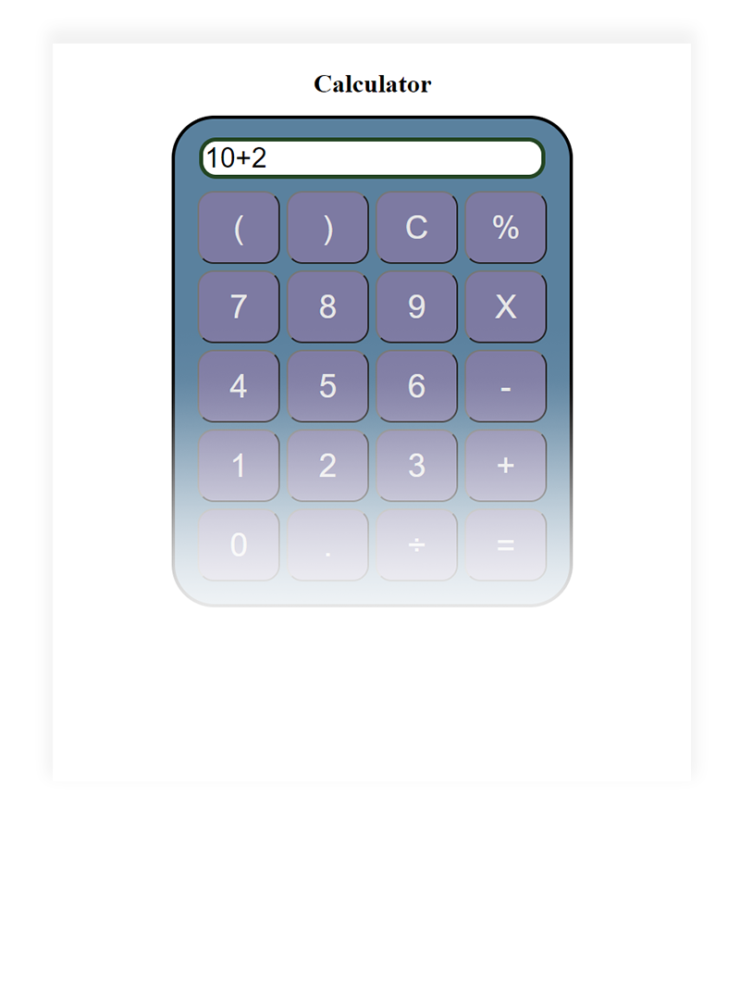

<h1 align="center">Basic Calculator</h1>

## General info

Basic calculator (addition, subtraction, multiplication, division, percentage, clear)

## Screenshots

 

  

## Technologies used
* HTML5
* CSS 
* JavaScript 

## License

This project is licensed under the MIT License. 